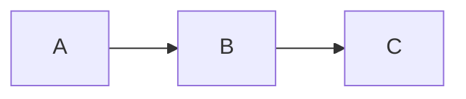

> **分类**: [分类] | **难度**: [难度] | **考察频率**: ⭐⭐⭐
>
> `标签 1` `标签 2`
>
> **一句话回答**: 用 30 秒能说清楚的核心答案

---

## 一、问题解析

### 1.1 面试官想考察什么
- 知识点 1
- 知识点 2

### 1.2 回答框架

```
1. 定义（10 秒）
2. 原理（30 秒）
3. 应用（20 秒）
4. 扩展（可选）
```

---

## 二、核心答案

### 2.1 定义
准确定义（背诵级）

### 2.2 原理



### 2.3 关键点

- **关键点 1**（必答）
- **关键点 2**（必答）
- **关键点 3**（加分项）

---

## 三、代码实现

```python
# 手撕代码级别
# 简洁、完整、可运行
```

---

## 四、进阶问题

<Collapsible title="🔥 面试官可能会追问">

**追问 1: 问题？**

回答要点：
- 要点 1
- 要点 2

**追问 2: 问题？**

回答要点：
- 要点 1
- 要点 2

</Collapsible>

---

## 五、常见错误

<Callout type="warning" title="⚠️ 避免这些错误">

- ❌ 错误 1
- ❌ 错误 2
- ❌ 错误 3

</Callout>

---

## 六、参考回答模板

### 30 秒版本

一句话概括 + 核心要点

### 2 分钟版本

定义 + 原理 + 应用 + 个人理解

### 深入版本

完整技术细节 + 代码 + 扩展讨论

---

## 七、相关题目

- [相关题目 1](链接)
- [相关题目 2](链接)

---

## 八、自测题

<Quiz question="以下哪项是正确的？">
<Answer correct="True">正确答案</Answer>
<Answer correct="False">错误答案</Answer>
<Answer correct="False">错误答案</Answer>
</Quiz>
